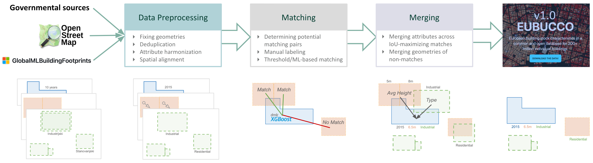

# Conflation Framework

To create a comprehensive and attribute-rich building stock dataset, EUBUCCO utilizes a multi-stage **geospatial conflation pipeline**. This process integrates fragmented datasets — authoritative governmental data, volunteered geographic information (OpenStreetMap), and ML-derived footprints (Microsoft) — into a single, non-redundant database.

The framework follows a strict hierarchy prioritizing sources with higher footprint precision and attribute quality.

1. **Governmental Data**
2. **Volunteered Data** (OpenStreetMap)
3. **ML-derived Data** (Microsoft Building Footprints)

---

*Figure 1: Overview of the EUBUCCO conflation pipeline, illustrating the journey from raw disparate sources to a harmonized, merged building database.*

---
## 1. Data Preprocessing

Before matching, data must be harmonized and cleaned to ensure spatial and semantic consistency across all inputs.

### Spatial Alignment (Rubbersheeting)
Datasets often exhibit systematic local shifts. We apply a localized **rubbersheeting** method to correct positional discrepancies.

* **Landmark Identification**: Reciprocal nearest neighbors are identified within a 25m threshold.
* **Offset Estimation**: Neighborhood-level offsets are calculated using **H3 grid cells** (Resolution 9).
* **Correction**: A uniform affine translation is applied to buildings within cells where systematic shifts are detected, correcting offsets >1m in 53% of cases.

### Deduplication and Repair
Internal consistency is enforced within each source to remove redundant footprints:

* **Geometry Repair**: Invalid or "broken" geometries are fixed or removed.
* **Deduplication**: We remove buildings that significantly overlap with others in the same dataset. If the IoSA exceeds a **tolerance threshold of 0.25**, the building with the smaller area is discarded.[^1]

    $$\text{IoSA}(a, b) = \frac{|a \cap b|}{\min(|a|, |b|)}$$

    <small>where $|\cdot|$ denotes the surface area.</small>

[^1]: We drop the smaller building since, in many cases, it represents a redundant building part or a sub-structure with special characteristics (e.g., a chimney or tower) that is already accounted for by the larger footprint.

### Attribute Cleaning and Harmonization
Raw attributes are often noisy or follow local schemas. We implement a rigorous cleaning pipeline:

* **Outlier Removal**: Unrealistic values are filtered out, such as building heights $>350m$, floor counts $>100$, or cases where the floor-to-height ratio suggests a floor height $<1.5m$. Construction years are extracted and clipped to a valid range (i.e. 0–2029).
* **Use Type Harmonization**: Source-specific tags are mapped to a harmonized use-type classification. This process includes the removal of non-building structures (e.g., traffic areas, radio masts, or underground structures) based on their source classification.

---
## 2. Matching

The core of the conflation process is identifying which footprint geometries from different sources refer to the same real-world structure.

### Candidate Selection
To manage computational complexity, we employ a **symmetrical k-nearest neighbors (k-NN)** search. For every building, we identify the top k=3 potential matches in the secondary dataset within a defined distance threshold and vice-versa.

### Machine Learning Classifier
Unlike traditional methods that use simple "rule-of-thumb" intersection thresholds (like IoU > 0.5), EUBUCCO employs a state-of-the-art **XGBoost classifier** to assess whether two footprint geometries refer to the same real-world structure.

* **Features**: The model is trained on **87 geometric and contextual features**, including intersection metrics, shape characteristics (elongation, convexity), and spatial context (neighbor density).
* **Performance**: This framework achieves an **F1-score of 99.7%**, significantly outperforming traditional intersection-based heuristics which often miss 12–57% of true matches.

| Feature Group | Examples |
| :--- | :--- |
| **Intersection** | IoU (Intersection over Union), IoA (Intersection over Area), IoSA , Aligned Area Overlap |
| **Shape** | Perimeter, Squareness, Corner Count, Longest Axis, Elongation, Convexity |
| **Similarity** | Centroid Distance, Wall Alignment, Shared Wall Length, Hausdorff Distance |
| **Contextual** | Neighbor counts (5m to 50m), Average alignment in neighborhood, Local density metrics |

---
## 3. Merging

Once matches are identified, the geometries and attributes are integrated to produce the final building record.

### Attribute Merging
Attributes (Type, Height, Floors, Construction Year) are merged across matching blocks using logic designed to maximize spatial consistency. We define the optimal source set $\mathcal{S}_a^*$ for a target building $a$ as the subset of available buildings $\mathcal{B}_a$ that maximizes the Intersection over Union (IoU):

$$\mathcal{S}_a^* = \arg\max_{\mathcal{S} \subseteq \mathcal{B}_a} \text{IoU}(a, \mathcal{S})$$

<small>where $\mathcal{B}_a$ represents the set of all matching building footprints from various sources for the target building $a$, and $\mathcal{S}$ is any possible combination of those footprints.</small>

#### Numerical Attributes
* **Merge Aggregation:** Building height, floors, and construction year are merged using **intersection-area–weighted averages**.

    $$V_{merged} = \frac{\sum_{i \in \mathcal{S}_a^*} (V_{source, i} \cdot w_i)}{\sum_{i \in \mathcal{S}_a^*} w_i}$$

    <small>where $V_{source, i}$ is the numerical value from source footprint $i$, and $w_i$ is the area of intersection between the target footprint $B_{target}$ and the $i$-th matching source footprint $B_{source, i}$.</small>

* **Confidence Scores**: To represent the reliability of numerical merges, we provide the range of contributing values:

    $$\text{Range} = [ \min(V_{source, i}), \max(V_{source, i}) ] \quad \forall i \in \mathcal{S}_a^*$$

    <small>where $\min$ and $\max$ denote the lowest and highest attribute values found among matching source footprints in the optimal source set.</small>

#### Categorical Attributes
* **Merge Aggregation:** Building types are assigned based on the **dominant category** by cumulative intersecting area.

    $$C_{merged} = \arg\max_{c \in \mathcal{C}} \sum_{i \in \mathcal{S}_{a, c}^*} \text{Area}(B_{target} \cap B_{source, i})$$

    <small>where $\mathcal{C}$ is the set of possible building categories, and $\mathcal{S}_{a, c}^*$ is the subset of matching buildings in $\mathcal{S}_a^*$ that belong to category $c$.</small>

* **Confidence Scores**: The confidence score represents the spatial agreement (Intersection over Area) of the source geometries relative to the target:

    $$\text{Confidence} = \frac{\text{Area}(B_{target} \cap \bigcup_{i \in \mathcal{S}_a^* } B_{source, i})}{\text{Area}(B_{target})}$$

    <small>where $\bigcup B_{source, i}$ represents the geometric union of all matching source footprints, and $B_{target}$ is the geometry of the target footprint.</small>

---

### Geometry Merging
Geometries are merged hierarchically based on the source priority. 

* **Block-Level Consistency**: We select the best footprint representation for an entire building block from a single source. 
* **Avoiding Fragmentation**: This prevents the "stitching together" of misaligned units from different sources, preserving the structural integrity of the building representation.
