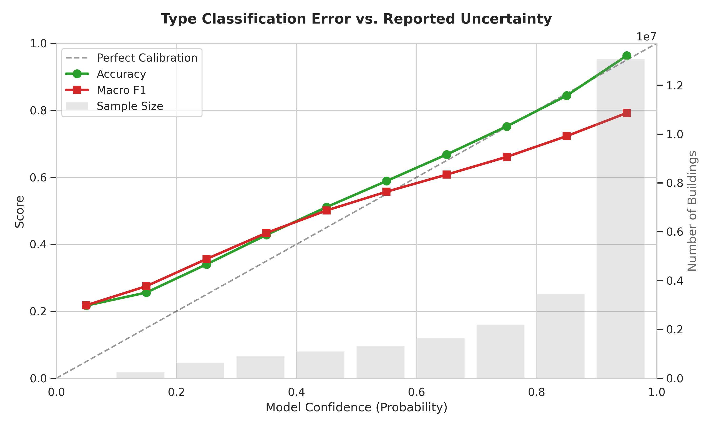
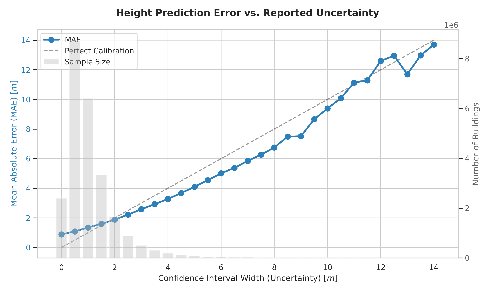

# Evaluation of Attribute Estimation

Evaluation metrics for machine learning predictions of building attributes in EUBUCCO.

> **Background**: While EUBUCCO integrates vast amounts of administrative and volunteered data, many buildings still lack key attributes such as building height, number of floors, or specific use types. Missing values are estimated using an XGBoost-based inference pipeline that leverages geometric properties of buildings and their urban context.

Metrics are computed on independent held-out test sets with ground truth labels from authoritative sources. All predictions include confidence scores that quantify uncertainty. For details on how confidence scores are calculated, see [Uncertainty Quantification](../data-format/uncertainty.md).

## Classification: Building Type

### Binary Use Type
Classification into residential and non-residential categories.

| Class | Precision | Recall | F1-Score | Support |
| :--- | :--- | :--- | :--- | :--- |
| **Residential** | 0.91 | 0.91 | 0.91 | 14,898,027 |
| **Non-residential** | 0.86 | 0.86 | 0.86 | 9,674,311 |
| **Accuracy** | | | **0.89** | 24,572,338 |

### Subtype
Detailed classification of building function into specific categories.

| Class | Precision | Recall | F1-Score | Support |
| :--- | :--- | :--- | :--- | :--- |
| **Residential** | 0.91 | 0.91 | 0.91 | 14,898,027 |
| **Others** | 0.73 | 0.77 | 0.75 | 4,366,359 |
| **Commercial** | 0.71 | 0.71 | 0.71 | 2,727,436 |
| **Agricultural** | 0.61 | 0.65 | 0.63 | 1,249,855 |
| **Industrial** | 0.55 | 0.51 | 0.53 | 838,715 |
| **Public** | 0.64 | 0.32 | 0.43 | 491,946 |
| **Accuracy** | | | **0.82** | 24,572,338 |

### Residential Type
Classification of residential buildings into specific architectural types.

| Class | Precision | Recall | F1-Score | Support |
| :--- | :--- | :--- | :--- | :--- |
| **Detached single-family house** | 0.98 | 0.97 | 0.98 | 1,066,876 |
| **Apartment block** | 0.85 | 0.87 | 0.86 | 180,189 |
| **Semi-detached duplex house** | 0.85 | 0.89 | 0.87 | 148,536 |
| **Terraced house** | 0.82 | 0.78 | 0.80 | 85,365 |
| **Accuracy** | | | **0.94** | 1,480,966 |

### Confidence Score

The classification error for building subtypes increases approximately linearly with the confidence score, where lower confidence values indicate higher uncertainty. This enables filtering of predictions based on accuracy requirements.

## Regression: Height & Floors
Continuous estimation of building height and number of floors using regression models.

| Attribute | MAE | RMSE | Support |
| :--- | :--- | :--- | :--- |
| **Floors** | 1.27 | 1.85 | 10,734,280 |
| **Height** | 1.43 m | 2.35 m | 24,745,273 |
| *Microsoft Height* | *2.29 m* | *3.24 m* | *12,824,553* |

!!! note "Benchmark Comparison"
    The *Microsoft Height* row shows Microsoft's predicted heights evaluated against ground truth for the same buildings where our approach is also evaluated, providing a direct performance comparison.

### Height-Dependent Error Distribution

Height prediction accuracy is inversely correlated with building height; the model is very precise for low-rise structures but shows increased variance for taller buildings.

| Height Range | MAE | RMSE | Support |
| :--- | :--- | :--- | :--- |
| **0-5 m** | 1.24 m | 1.70 m | 11,834,939 |
| **5-10 m** | 1.21 m | 1.59 m | 10,825,390 |
| **10-20 m** | 3.02 m | 3.77 m | 1,940,058 |
| **20 m+** | 11.68 m | 18.07 m | 144,886 |

### Confidence Score

The prediction error increases approximately linearly with the confidence interval width (upper - lower bound), where wider intervals indicate higher uncertainty. This enables filtering of predictions based on accuracy requirements.

