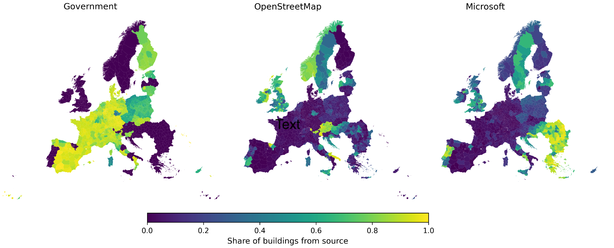

# Welcome to EUBUCCO

**EUBUCCO** is a scientific database of individual building footprints for **322+ million buildings** across the 27 European Union countries, Norway, Switzerland, and the UK. It is composed of **55 open datasets**, including government registries (62.2%), OpenStreetMap (17.4%), and Microsoft building footprints (20.4%) that have been collected, harmonized, and validated.

## Attribute Coverage

The database provides high-granularity information for building type, height, floors, and construction year. To maximize utility, EUBUCCO distinguishes between *Ground Truth*, *Merged* (from other buildings footprint datasets), and *Estimated* (inferred with machine learning) attributes.

| Attribute | Ground Truth | Merged | ML Estimated | Total Coverage |
| :--- | :---: | :---: | :---: | :---: |
| **Type** (res/non-res) | 38.1% | 7.4% | 54.5% | **100.0%** |
| **Subtype** | 17.3% | 4.2% | 78.5% | **100.0%** |
| **Height** | 43.2% | 0.1% | 56.7% | **100.0%** |
| **Floors** | 16.6% | 3.4% | 79.9% | **100.0%** |
| **Construction Year** | 15.6% | 0.3% | 0.0% | **15.9%** |

* Type categories: `residential` and `non-residential`.
* Subtype categories: `industrial`, `commercial`, `public`, `agricultural`, `others`, `detached`, `semi-detached`, `terraced`, and `apartment`.

## Accessing the Data
The data is stored as `.parquet` files on a S3-compatible object storage (MinIO) and can be accessed in multiple ways:

| Method | Best For | Description |
| :--- | :--- | :--- |
| **[Website](../../data-access/website)** | Less technical users | Download individual region files via a map-based interface. |
| **[CLI](../../data-access/cli)** | Bulk downloads | Sync entire countries or the full dataset to your local storage. |
| **[Python](../../data-access/python)** | Quick data exploration | Stream specific regions into memory (GeoPandas) or filter chunks (PyArrow). |
| **[SQL (DuckDB)](../../data-access/sql)** | Advanced Filtering | Query the cloud data directly to download only specific subsets (e.g., buildings > 50m). |
| **[Zenodo](../../data-access/zenodo)** | Research & Citations | Access stable, versioned snapshots for scientific reproducibility. |

<!-- ## Getting Started Notebooks
Check out our getting started example Jupyter notebook [tutorial](https://github.com/ai4up/eubucco/blob/main/tutorials/getting-started.ipynb) on GitHub. -->

## Contribute
You know of an open dataset that is not yet included or you've spotted a bug? Drop us an email at info(at)eubucco.com or open an issue in our GitHub [repository](https://github.com/ai4up/eubucco).
